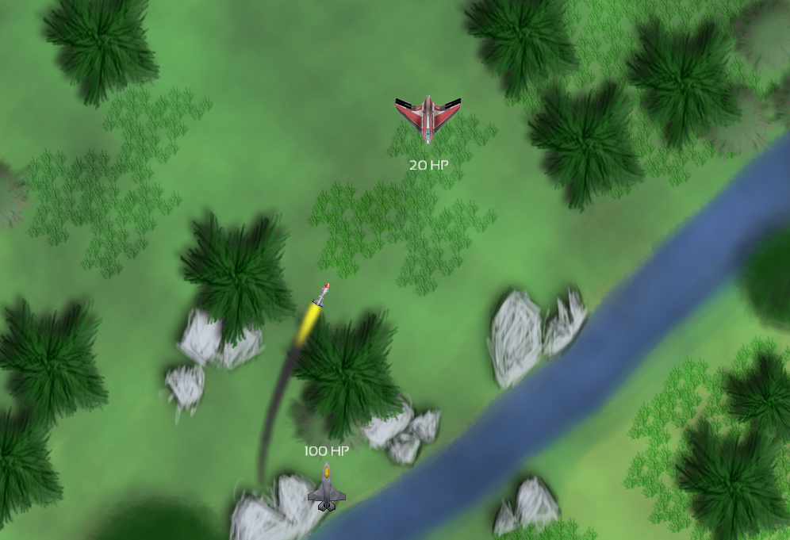

# Space Shooter Project

Just a simple 2D shooter game. I did this project in order to learn and practice some concepts used in game programming.

This project is inspired from the book [SFML Game Development](http://www.amazon.com/SFML-Game-Development-Jan-Haller/dp/1849696845), this is were the sprites come from.

